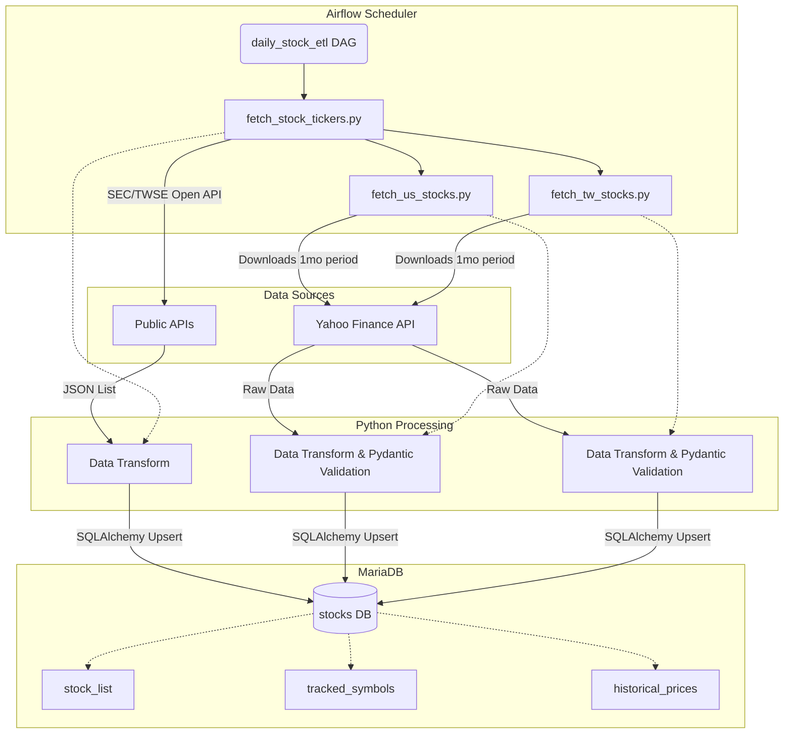

# Stocks Worker - ETL Pipeline Specification

## 1. System Overview

The Stocks Worker is a data pipeline application that fetches historical stock prices for US and Taiwan (TW) markets and stores them in a relational database. It utilizes **Apache Airflow** for scheduling and orchestration, **MariaDB** for data storage, and **yfinance** for fetching Yahoo Finance data.

## 2. Architecture & Infrastructure

- **Deployment**: Managed via `docker-compose.yml`.
- **Services**:
  - `mariadb`: MariaDB 11.4 database instance.
  - `airflow-webserver` & `airflow-scheduler`: Airflow components (image `apache/airflow:3.1.7-python3.12`) with `LocalExecutor`.
- **Volumes mapped**:
  - `etl/dags`, `etl/logs`, `etl/plugins`, `etl/scripts` to `/opt/airflow/...`
  - `db/init.sql` to `/docker-entrypoint-initdb.d/` for database initialization.

## 3. Data Flow

